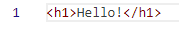

## Вивчення Git. Колєснік Євгеній ІПЗ-4.01

## Налаштування середи

Встановимо пошту та ім'я користувача у git:

> git config --global user.name "evgenykolesnik"

> git config --global user.email "evgenykolesnikev@gmail.com"

Вставновимо правила обробки закінчень файлів:

> git config --global core.autocrlf true

> git config --global core.safecrlf warn

## Новий проєкт

Створимо папку `git` для нового проєкту та розмістимо в середині файл `hello.html`. Ініціалізуємо git:

> git init

Додамо файл `hello.html`:

> git add hello.html

Створимо коміт з повідомленням `init`:

> git commit -m "init"

Перевіримо статус:

> git status

Результат:


Ми знаходимось на головній гілці, нічого додавати до коміту.

## Редагування файлу

Змінимо файл `hello.html`, новий вміст:

```html
<h1>Hello!</h1>
```

Перевіримо статус:

> git status

Результат:


Git побачив зміни файлу `hello.html`.

Додамо файл до наступного коміту та перевіримо статус:

> git add hello.html

> git status

Результат:


Git показав, що були додані до коміту зміни `hello.html`.

Створимо коміт та переглянемо логи репозиторію:

> git commit -m "add tag"

> git log --oneline

Результат:


Git показав наявність двох комітів.

## Отримання попередніх версій

Перевіримо файл `hello.html`. Результат:



Переключимось на попередню версію репозиторію:

> git checkout 10eb4d0

Знову перевіримо файл `hello.html`. Результат:


Файл знову став пустим.

Повернемося на останній коміт:

> git switch main

Знову перевіримо файл `hello.html`. Результат:


У файлі вернувся тег h1.

## Додання тегів

Додамо теги до комітів:

```bash
git tag v1 10eb4d0
git tag v2 5f472f0
```

Перевіримо теги:

> git tag

Результат:


Git знайшов два тега `v1` та `v2`.

## Скасування запланованих дій

Змінимо файл `hello.html`. Результат:


Додамо зміну файлу `hello.html`:

> git add hello.html

Перевіримо статус:

> git status

Результат:


Відмінемо додання файлу `hello.html`:

> git reset HEAD hello.html

Переведемо файл `hello.html` до версії останнього коміту:

> git checkout hello.html

Перевіримо файл `hello.html`. Результат:


Файл повернувся до версії з одним заголовком.

## Відкат коміту

Змінимо файл `hello.html` та створимо новий коміт:

```bash
git add hello.html
git commit -m "bad commit"
```

Перевіримо результат:

> git log --oneline

**Результат:**


Створимо коміт, який відкатить зміни поточного:

> git revert HEAD

Перевіримо результат:

> git log --oneline

Результат:


Промаркуємо поточний коміт як `currpoint`:

> git tag currpoint

Перевіримо результат:

> git log --oneline

Результат:


Повернемося до версії `v1`:

> git reset --hard v1

Перевіримо результат:

> git log --all --oneline

Результат:


Новий поточний коміт — коміт з тегом `v1`.

Видалимо тег `currpoint`:

> git tag -d currpoint

Перевіримо результат:

> git log --all --oneline

Результат:


Зайві коміти зникли з історії комітів після видалення тегу.

## Зміна останнього коміту

У файл `hello.html` було додано новий рядок:


Створимо коміт:

> git add hello.html

> git commit -m "add new row"

Перевіримо результат:

> git log --oneline

Результат:


Додамо точку у кінець рядка файлу `hello.html`:


Виконаємо злиття:

> git add hello.html

> git commit --amend -m "add point"

Перевіримо результат:

> git log --oneline

Результат:


## Створення гілки

Створімо нову гілку для скриптів:

> git switch -c scripts

Перевіримо статус репозиторія:

> git status

Результат:


Створилася гілка `scripts`, яка стала поточною.

Створімо файл `script.js` для скрипту.

З вмістом:

```javascript
let a = 10;
```

Додамо зміни:

> git add script.js

> git commit -m "add js file"

Змінимо файл `hello.html`:


Додамо зміни:

> git add hello.html

> git commit -m "changed html file"

## Безпечне перейменування файлів

Змінимо назву файлу `hello.html` на `trash.html`: 

> git mv hello.html trash.html

Додамо зміни:

> git add .

> git commit -m "change name of hello.html file"

## Завантаження репозиторія на github

Додамо віддалений репозиторій:

> git remote add origin https://github.com/evgenykolesnikev/git.git

Завантажимо обидві гілки:

> git push -u origin main

> git push -u origin scripts

Результат:

Перевіримо репозиторій на сайті `https://github.com`:


## Висновок

Виконуючи цю роботу я підтвердив теоретичний матеріал по роботі з системою git. Під час виконання роботи я ознайомився з роботою у системі git створивши тестовий репозиторій. Система Git дозволяє гнучко управляти версіями файлів розроблювальних програмних систем. Отриманні знання є основою при розробці систем пов'язаних з роботою з координатами.